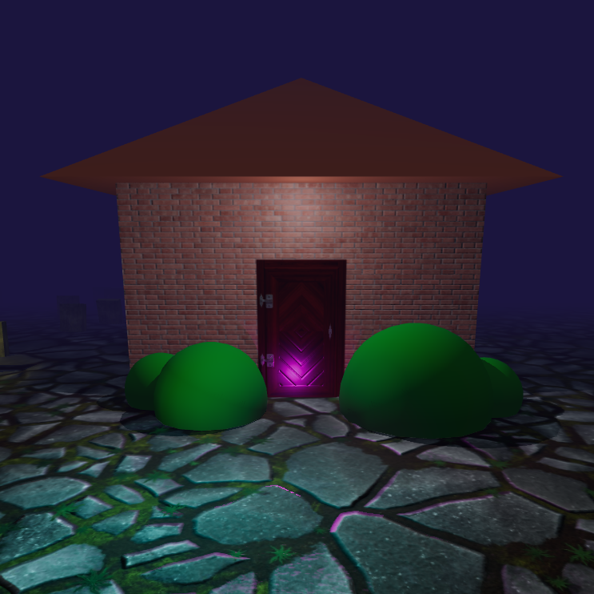
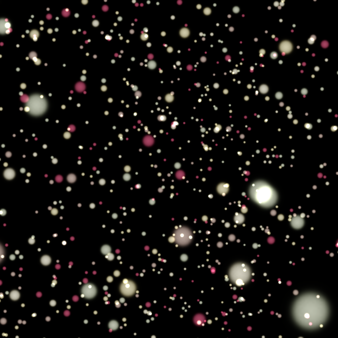
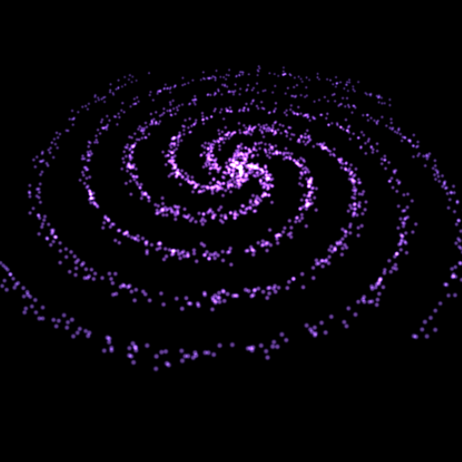
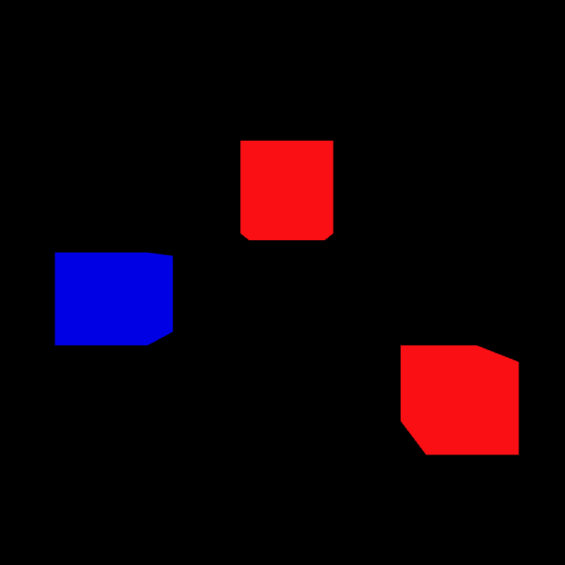
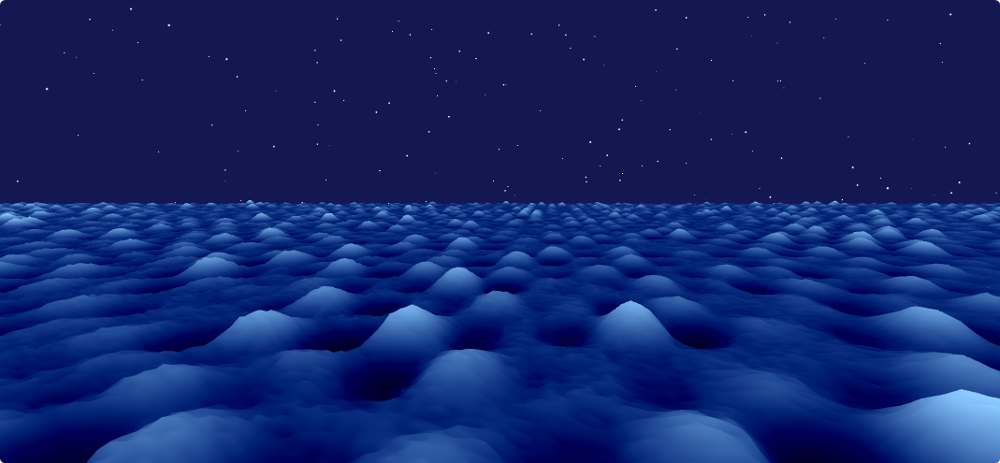
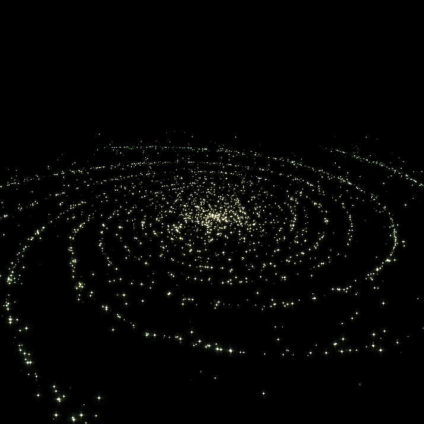
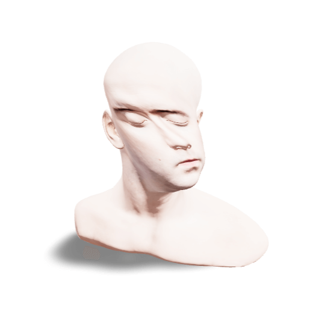
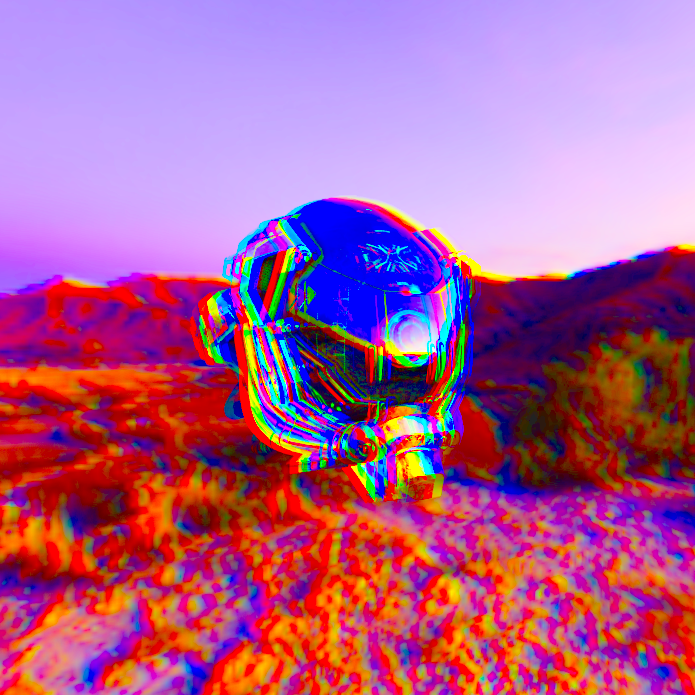
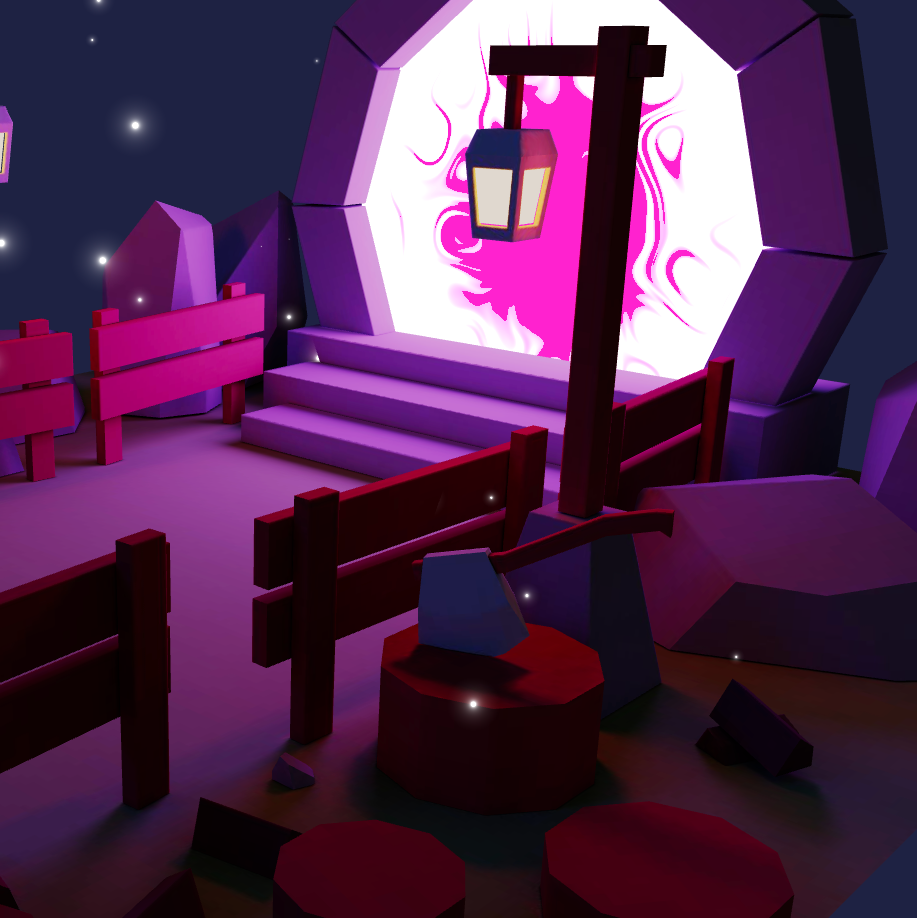
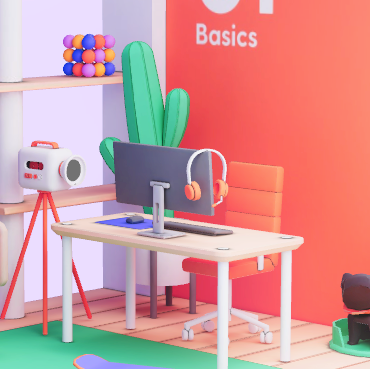

👉 Visit examples at https://journey.pmnd.rs/

A community driven collection of lesson-examples from Bruno Simons [threejs-journey](https://threejs-journey.com) ported to [React](https://github.com/pmndrs/react-three-fiber). Threejs-journey is one of the best resources available for learning Threejs.

The goal is to ease the learning curve by moving from OOP to components, which reduce code and encourage clean separation. You will progress much quicker since each primitive is a separate unit that can be studied as such, as opposed to something that is connected to practically everything else across the project.

At the moment the focus is on structural patterns and the experience, these examples are reduced and will use eco-system spare parts where possible.

# Examples

## Basics

  <h3>Textures</h3>
  
  

  

  <h3>Materials</h3>
  
  

  

  <h3>3D Text</h3>
  
  

  

## Classic Techniques

  <h3>Lights</h3>
  
  

  

  <h3>Haunted House</h3>
  
  

  

  <h3>Particles</h3>
  
  

  

  <h3>Particles Animated</h3>
  
  

  

  <h3>Galaxy Generator</h3>
  
  

  

  <h3>Raycaster</h3>
  
  

  

  <h3>Scroll Based Animation</h3>
  
  

  

## Advanced Techniques

  <h3>Physics</h3>
  
  

  

## Shaders

  <h3>Shader Patterns</h3>
  
  

  

  <h3>Raging Sea</h3>
  
  

  

  <h3>Animated Galaxy</h3>
  
  

  

  <h3>Modified Material</h3>
  
  

  

## Extra

  <h3>Post Processing</h3>
  
  

  

  <h3>Loading</h3>
  
  

  

  <h3>Mixing Html and Webgl</h3>
  
  

  

  <h3>Portal</h3>
  
  

  

## Levels

  <h3>Level 1</h3>
  
  

  

